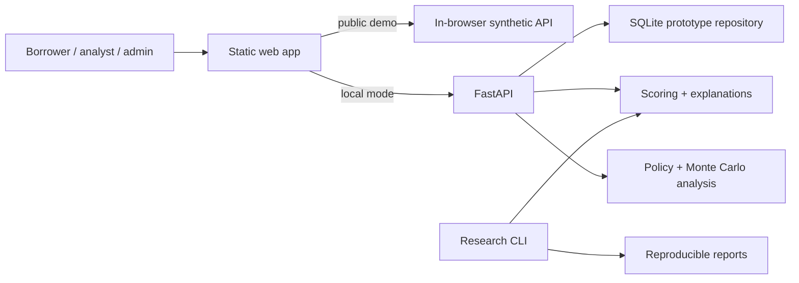

# MicroScore

[](https://github.com/alex-tereshkovv/micro-score/actions/workflows/ci.yml)

Interpretable credit-risk research and decision-support prototype for thin-file
borrowers in Pavlodar, Kazakhstan.

## Try The Live Demo

- [Role-based product demo](https://alex-tereshkovv.github.io/micro-score/)
- [Three-minute engineering case study](https://alex-tereshkovv.github.io/micro-score/#/review)
- [Two-minute guided presentation](https://alex-tereshkovv.github.io/micro-score/showcase.html)
- [Engineering evidence hub](https://alex-tereshkovv.github.io/micro-score/evidence.html)

Demo accounts: `borrower@test.com`, `analyst@test.com`, and
`admin@test.com`. Password: `password123`. Staff/admin MFA code: `246810`.

The public demo uses synthetic data stored only in the browser. It is not a
lending service and does not collect real borrower data.

## Snapshot

| Field | Current state |
| --- | --- |
| Purpose | Explore interpretable alternative credit risk with human review |
| Product | Static web demo plus local FastAPI/SQLite prototype |
| Models | Logistic Regression and Random Forest |
| Research tracks | Synthetic Pavlodar experiment + public UCI benchmark |
| Main finding | Synthetic performance depends heavily on `late_payment_count` |
| Key limitation | No validation on real Kazakhstan MFI borrower data |
| Public benchmark | UCI Random Forest ROC-AUC `0.775`, Brier score `0.159` |
| Governance | Versioned models, audit trail, policy analysis, seeded Monte Carlo |
| Quality gate | 126 automated tests plus research, API, database, and browser smoke checks |

## Why This Matters

Thin-file borrowers can be rejected because they lack conventional credit
history, not because their risk is known to be high. MicroScore investigates
whether behavioral signals could support a more informative review while
keeping the model interpretable, the decision human-controlled, and the limits
of the evidence explicit.

## Research Findings

| Experiment | Result | Interpretation |
| --- | ---: | --- |
| Synthetic Logistic Regression | ROC-AUC `0.806` | Moderate ranking performance |
| Synthetic Random Forest | ROC-AUC `0.830` | Stronger nonlinear baseline |
| `late_payment_count` only | ROC-AUC `0.827` | One feature nearly reproduces the full result |
| Random Forest without that feature | ROC-AUC `0.492` | Thin-file signal falls near random |
| Public UCI Random Forest | ROC-AUC `0.775` | Pipeline works on a real public benchmark, but not local MFI data |

The ablation result is the central research finding: the current synthetic
dataset is useful for engineering the system, but it cannot justify real
lending claims. Threshold policies also show that approval access, manual
review workload, and loss exposure move in different directions.

## System Design



The browser demo makes the workflows reviewable without a server. Local mode
uses the same interface with a real API, persistence, tenant scoping, model
registry, audit events, and application lifecycle rules. SQLite is the current
runtime database; PostgreSQL migrations and an adapter are under development
and are not presented as production-ready.

## Run Locally

Install dependencies:

```powershell
.venv\Scripts\python -m pip install -r requirements.txt
```

Run the complete Windows demo:

```powershell
.\Start-MicroScore.cmd
```

Run the research pipeline and full quality gate:

```powershell
.venv\Scripts\python -m microscore --reports
powershell -ExecutionPolicy Bypass -File scripts\check.ps1
```

For macOS/Linux, replace `.venv\Scripts\python` with `.venv/bin/python`.
Manual API and web-server commands are documented in
[apps/web/README.md](apps/web/README.md).

## Project Map

- `apps/web/` — static frontend and browser-only synthetic demo
- `src/microscore/` — research, modeling, ablation, policy, and reporting code
- `src/microscore_api/` — FastAPI product prototype and repositories
- `migrations/postgresql/` — reviewed PostgreSQL migration artifacts
- `reports/` — reproducible research and benchmark outputs
- `tests/` — unit, integration, API, database, and frontend checks

## Read The Project

- [Project brief](docs/PROJECT_BRIEF.md) — the shortest complete overview
- [Research paper PDF](output/pdf/MicroScore_Research_Paper.pdf) · [source](docs/RESEARCH_PAPER.md) — question, method, evidence, limitations
- [Technical interview guide](docs/TECHNICAL_INTERVIEW_GUIDE.md) — explain the central engineering and ML decisions
- [Architecture](docs/ARCHITECTURE.md) — runtimes, data flow, boundaries, and gaps
- [Model card](docs/MODEL_CARD.md) — intended use, metrics, risks, and oversight
- [Monte Carlo methodology](docs/MONTE_CARLO_METHODOLOGY.md) — assumptions and statistical boundaries
- [Engineering quality](docs/ENGINEERING_QUALITY.md) — verification strategy
- [Pilot data schema](docs/PILOT_DATA_SCHEMA.md) — minimum-data and privacy boundary
- [Engineering case study PDF](output/pdf/MicroScore_Engineering_Case_Study.pdf)

## Scope And Limitations

MicroScore is a research-and-product prototype, not a production credit model.
It must not be used for real approval or rejection. Its Pavlodar borrower data
is synthetic; the UCI benchmark comes from Taiwan credit-card data; financial
and Monte Carlo assumptions are methodological examples rather than calibrated
forecasts. Real use would require consented local data, external validation,
security and privacy review, calibrated economics, monitoring, and accountable
human decision-making.

## Author

Alexandr — Pavlodar, Kazakhstan

The project began with a local question: can people with little formal credit
history be evaluated using better evidence without hiding uncertainty or
removing human responsibility? MicroScore is my attempt to answer that question
through reproducible research and a working system.
