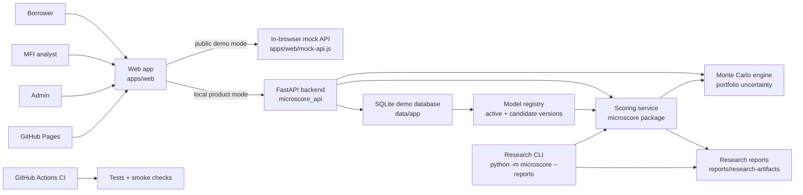

# MicroScore Architecture

MicroScore is split into three layers: a research pipeline, a local product
prototype, and a public static demo. This keeps the project easy to review now
while leaving a path toward a real borrower/MFI application later.

## System Overview



## User Roles

| Role | Current workspace | Main actions |
| --- | --- | --- |
| Borrower | Borrower portal | Submit a synthetic application and check status. |
| MFI analyst | Review queue | Score applications, inspect explanations, review policy analytics. |
| Admin | Audit trail | Inspect system actions and demo governance events. |

The first production version should remain human-in-the-loop. The model should
support MFI analysts, not automatically approve or reject real borrowers.

## Runtime Modes

### Public Static Demo

URL: https://alex-tereshkovv.github.io/micro-score/

This mode runs entirely in the browser. It uses `apps/web/mock-api.js` to mimic
the backend with synthetic demo data. It is designed for admissions reviewers,
teachers, and non-technical viewers who should not need PowerShell or local
setup.

What it can show:

- role-based login flow;
- borrower application form;
- MFI queue and score detail;
- Portfolio Dashboard v2 with district and settlement-type summaries;
- policy analytics and static explanations;
- admin audit trail;
- safe reset of synthetic demo state.

What it cannot prove:

- real backend uptime;
- production security;
- real MFI data validity;
- real-world credit-risk performance.

### Local Product Prototype

The local mode uses the same web app with a FastAPI backend:

```powershell
.\Start-MicroScore.cmd
```

Main local components:

- `src/microscore_api/` for authentication, applications, scoring, decisions,
  and audit endpoints;
- expiring bearer sessions with visible expiry metadata, backend token
  revocation, and restricted browser origins for the current prototype boundary;
- borrower-only public registration, staff-role provisioning, password policy,
  and a single-process login attempt limiter;
- admin-only MFI analyst creation plus expiring/revocable staff invites with
  one-time raw tokens, analyst-side password setup, public user listings,
  invite status listings, analyst disable/reactivation, session revocation,
  and audit events;
- organization-scoped applications, queues, review packets, exports, and
  analytics, with global visibility reserved for admins;
- dynamic organization discovery for borrower routing and admin staff
  provisioning;
- client-side Portfolio Dashboard v2 summaries derived from the scoped MFI
  queue, with static-demo parity for district risk and settlement-type mix;
- persistent model registry with candidate/active/inactive lifecycle states,
  deterministic runtime configuration, activation audit events, and immutable
  score provenance snapshots;
- stale-score detection in review packets after an administrator activates a
  newer model version;
- tenant-scoped, seeded Monte Carlo simulation for baseline/adverse/severe
  portfolio outcomes with audited assumptions, snapshot fingerprints, numerical
  precision diagnostics, and an immutable run registry;
- SQLite demo database generated under `data/app/`;
- seeded accounts for borrower, analyst, and admin testing;
- scoring functions from the internal `microscore` package.

This mode is closer to the future product because the API, database, and audit
events are real local services instead of browser-only mock data.

### Research Pipeline

The research CLI runs experiments and produces artifacts:

```powershell
.venv\Scripts\python -m microscore --reports
```

It supports:

- leakage checks;
- proxy-risk analysis for `late_payment_count`;
- ablation studies;
- calibration and Brier score review;
- segment/fairness audit;
- threshold policy analysis;
- public benchmark evaluation.

## Data Flow

1. A borrower submits an application through Application Intake v2. A shared
   browser/static contract provides field feedback, while the typed API remains
   authoritative and rejects unknown signals, unsafe ranges, and inconsistent
   district/settlement pairs.
2. The borrower workspace lists only that account's applications through a safe
   projection that excludes internal scores, staff identity, and review notes.
3. The app stores or simulates the application depending on runtime mode.
4. The API resolves the single active model registry record and builds the
   deterministic scoring runtime from its version and random state.
5. The scoring layer creates a probability, risk band, explanation, warnings,
   and an immutable governance snapshot.
6. The analyst reviews the result together with model-use notices and policy
   context. Risk Detail v2 combines lifecycle capabilities, affordability
   screening indicators, governance checks, explanations, and complete human
   decision history in one typed review packet.
7. A strict lifecycle state machine prevents terminal approvals or declines
   from being silently re-scored or reversed.
8. The Monte Carlo engine applies a selected policy to scored applications and
   reports paired uncertainty ranges without changing borrower scores, then
   stores the request and exact result under a tenant-scoped run ID.
9. Analysts can compare or reopen registered simulations; the portfolio
   fingerprint reveals whether the underlying scored snapshot changed.
10. A later model activation marks older scores as stale without rewriting their
   original provenance.
11. Admin/audit views record demo actions so decisions remain inspectable.

## Privacy Boundary

MicroScore must not collect real personal identifiers in the current prototype.
This includes names, IINs, phone numbers, addresses, real bank statements, or
private account records.

The current public demo is intentionally synthetic and browser-local. That is a
product choice, not a missing feature: it makes the demo safer for public review
while the research is still pre-pilot.

## Deployment Boundary

| Environment | Purpose | Data |
| --- | --- | --- |
| GitHub Pages | Public demo and admissions review | Synthetic browser data only |
| Local FastAPI | Product development | Seeded SQLite demo data |
| Research CLI | Model experiments | Synthetic and public benchmark datasets |
| Future cloud API | Pilot candidate | Requires privacy, security, and legal review |

## Known Architecture Gaps

- No production authentication provider yet.
- No PostgreSQL deployment yet.
- No real MFI borrower data yet.
- No signed external model-artifact store or production drift monitoring yet.
- Monte Carlo stress shifts and financial assumptions are transparent defaults,
  not estimates calibrated from real MFI outcomes.
- The pilot-data schema is defined, but it has not been validated with a real
  Pavlodar MFI dataset.

These gaps are intentional next milestones. The current architecture keeps the
project honest: public demo for accessibility, local API for product realism,
and research pipeline for reproducible model work.
