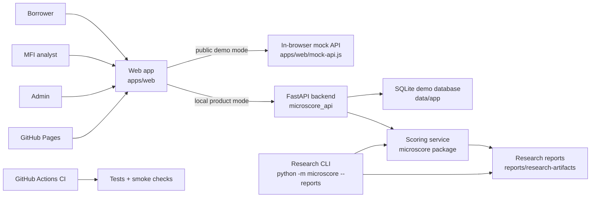

# MicroScore Architecture

MicroScore is split into three layers: a research pipeline, a local product
prototype, and a public static demo. This keeps the project easy to review now
while leaving a path toward a real borrower/MFI application later.

## System Overview



## User Roles

| Role | Current workspace | Main actions |
| --- | --- | --- |
| Borrower | Borrower portal | Submit a synthetic application and check status. |
| MFI analyst | Review queue | Score applications, inspect explanations, review policy analytics. |
| Admin | Audit trail | Inspect system actions and demo governance events. |

The first production version should remain human-in-the-loop. The model should
support MFI analysts, not automatically approve or reject real borrowers.

## Runtime Modes

### Public Static Demo

URL: https://alex-tereshkovv.github.io/micro-score/

This mode runs entirely in the browser. It uses `apps/web/mock-api.js` to mimic
the backend with synthetic demo data. It is designed for admissions reviewers,
teachers, and non-technical viewers who should not need PowerShell or local
setup.

What it can show:

- role-based login flow;
- borrower application form;
- MFI queue and score detail;
- policy analytics and static explanations;
- admin audit trail;
- safe reset of synthetic demo state.

What it cannot prove:

- real backend uptime;
- production security;
- real MFI data validity;
- real-world credit-risk performance.

### Local Product Prototype

The local mode uses the same web app with a FastAPI backend:

```powershell
.\Start-MicroScore.cmd
```

Main local components:

- `src/microscore_api/` for authentication, applications, scoring, decisions,
  and audit endpoints;
- SQLite demo database generated under `data/app/`;
- seeded accounts for borrower, analyst, and admin testing;
- scoring functions from the internal `microscore` package.

This mode is closer to the future product because the API, database, and audit
events are real local services instead of browser-only mock data.

### Research Pipeline

The research CLI runs experiments and produces artifacts:

```powershell
.venv\Scripts\python -m microscore --reports
```

It supports:

- leakage checks;
- proxy-risk analysis for `late_payment_count`;
- ablation studies;
- calibration and Brier score review;
- segment/fairness audit;
- threshold policy analysis;
- public benchmark evaluation.

## Data Flow

1. A borrower submits an application with financial and behavioral fields.
2. The app stores or simulates the application depending on runtime mode.
3. The scoring layer creates a probability, risk band, explanation, and warning
   flags.
4. The analyst reviews the result together with model-use notices and policy
   context.
5. Admin/audit views record demo actions so decisions remain inspectable.

## Privacy Boundary

MicroScore must not collect real personal identifiers in the current prototype.
This includes names, IINs, phone numbers, addresses, real bank statements, or
private account records.

The current public demo is intentionally synthetic and browser-local. That is a
product choice, not a missing feature: it makes the demo safer for public review
while the research is still pre-pilot.

## Deployment Boundary

| Environment | Purpose | Data |
| --- | --- | --- |
| GitHub Pages | Public demo and admissions review | Synthetic browser data only |
| Local FastAPI | Product development | Seeded SQLite demo data |
| Research CLI | Model experiments | Synthetic and public benchmark datasets |
| Future cloud API | Pilot candidate | Requires privacy, security, and legal review |

## Known Architecture Gaps

- No production authentication provider yet.
- No PostgreSQL deployment yet.
- No real MFI borrower data yet.
- No production monitoring or model drift tracking yet.
- No validated Pavlodar pilot-data schema yet.

These gaps are intentional next milestones. The current architecture keeps the
project honest: public demo for accessibility, local API for product realism,
and research pipeline for reproducible model work.
