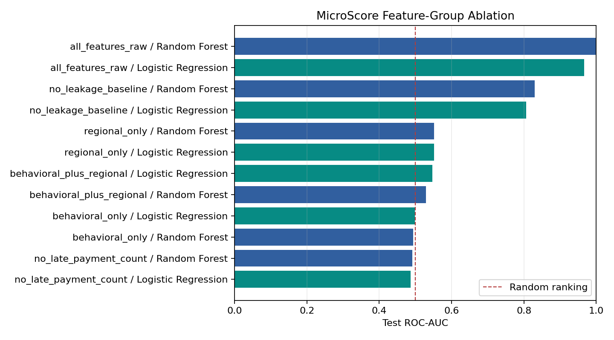
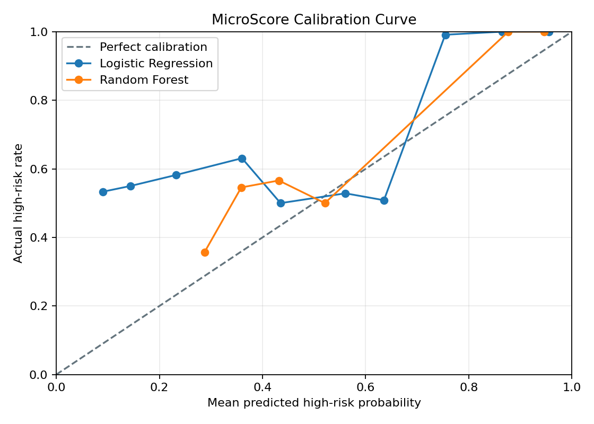

# MicroScore: An Interpretable Decision-Support Prototype for Thin-File Credit Risk

**Alexandr | Pavlodar, Kazakhstan | September 2026**

## Abstract

Thin-file borrowers have too little conventional credit history for many
standard underwriting processes, but alternative behavioral data can introduce
new privacy, proxy, and reliability risks. MicroScore studies this tension
through a reproducible machine-learning pipeline and a working decision-support
prototype. Experiment A uses 5,000 synthetic borrower records to compare
Logistic Regression and Random Forest, audit leakage and proxy dependence, test
feature-group ablations, examine calibration and classification errors, and
compare three-zone lending policies. Experiment B applies the same evaluation
discipline to the public UCI Default of Credit Card Clients dataset. On the
synthetic held-out set, Random Forest reaches ROC-AUC 0.830 and Logistic
Regression reaches 0.806. However, `late_payment_count` alone reaches
directional ROC-AUC 0.827, and removing it reduces both models to approximately
random ranking (0.486-0.492). On the UCI benchmark, Random Forest reaches
ROC-AUC 0.775 and Brier score 0.159. These results show that a credible score
cannot be judged from one headline metric: feature provenance, ablation,
calibration, policy effects, and deployment context are equally important.
MicroScore is therefore presented as a human-in-the-loop research prototype,
not a validated lending model.

**Keywords:** alternative credit scoring; thin-file borrowers; interpretable
machine learning; ablation; calibration; decision thresholds; responsible AI

## 1. Introduction

Credit reporting can exclude people and small businesses that lack documented
income, bank accounts, or a sufficiently detailed repayment record. Alternative
data may help construct a fuller view of thin-file applicants, but it can also
amplify inaccurate, opaque, or discriminatory signals [1, 2]. A technically
strong classifier is therefore not sufficient. A lending support system must
also reveal what drives the score, how sensitive the result is to individual
features, what policy converts a probability into an action, and where the
evidence stops.

MicroScore investigates these questions in the context of a possible regional
microfinance workflow in Pavlodar, Kazakhstan. The project combines two layers:

- a research pipeline for modeling, ablation, calibration, error analysis,
  segment review, and public benchmark validation;
- a product prototype with borrower, analyst, and administrator workflows,
  model provenance, audit events, threshold policies, and portfolio simulation.

The intended contribution is not a new state-of-the-art scoring algorithm. It
is a transparent engineering study of how an apparently promising model can be
challenged before it is trusted.

## 2. Research Questions

The study asks four questions:

1. How well do interpretable linear and nonlinear baseline models rank synthetic
   credit risk after obvious leakage-like fields are removed?
2. Does the result survive removal of repayment-history and feature groups that
   may not exist for genuinely thin-file borrowers?
3. How do probability thresholds change approval access, manual-review load,
   and exposure to high-risk cases?
4. Can the same evaluation pipeline operate on a real public benchmark without
   treating that benchmark as local validation?

## 3. Background And Related Work

The World Bank and International Committee on Credit Reporting describe
alternative data as a possible route to richer credit profiles for thin-file or
credit-invisible customers, while emphasizing consent, data quality,
discrimination, cybersecurity, and explainability risks [1, 2]. This motivates
MicroScore's decision to treat alternative data as evidence to be audited, not
as automatically fairer data.

The public benchmark originates from the UCI Default of Credit Card Clients
dataset and the accompanying study by Yeh and Lien [3, 4]. It contains real
Taiwan credit-card records and supports comparison with a recognized binary
default-prediction task. Its geography, borrower type, and product remain
different from Pavlodar microfinance, so it tests pipeline portability rather
than local validity.

Model reporting follows the principle behind Model Cards: intended use,
evaluation context, limitations, and ethical considerations should accompany
performance results [5]. ROC analysis is used for ranking performance [6],
while probability quality is also examined with Brier score and calibration
tables because ranking alone does not establish reliable probabilities.

## 4. Data And Evidence Boundary

### 4.1 Experiment A: Synthetic Prototype Data

Experiment A uses `data/raw/credit_risk_dataset.csv`, containing 5,000
synthetic rows and 22 raw columns. The target `credit_risk` has 3,829 positive
and 1,171 negative examples. Variables include income, balance, deposits,
digital banking activity, debt, loan amount, open loans, and late-payment count.

The dataset is suitable for deterministic software tests, workflow design, and
diagnostic experiments. It is not evidence about real borrowers. Its target and
feature relationships may reflect assumptions embedded during synthetic data
creation rather than relationships that would generalize to an MFI population.

The optional Pavlodar regional layer is also a scaffold. Administrative names
and public regional context are separated from assumed fields such as digital
access, distance, and seasonal-income risk. These assumptions are documented in
`data/external/README.md` and must not be interpreted as measured borrower
attributes.

### 4.2 Experiment B: Public UCI Benchmark

Experiment B uses the UCI Default of Credit Card Clients dataset, which contains
30,000 records from Taiwan and is distributed under CC BY 4.0 [3]. MicroScore
normalizes its fields into the same evaluation workflow but keeps all benchmark
artifacts in a separate directory. Results are never merged with the synthetic
experiment.

### 4.3 Leakage And Proxy Controls

The leakage-safe baseline removes identifiers and target-like or unrealistic
fields:

- `customer_id`;
- `credit_score`;
- `loan_default_history`;
- `fraud_flag`.

`late_payment_count` is retained in the baseline so its influence can be
measured rather than hidden. It is then removed in a dedicated thin-file stress
test. Adjacent monetary, affordability, formal-credit, and digital-access
signals are monitored as possible proxies, because they may represent wealth,
infrastructure, or prior access rather than repayment reliability.

## 5. Experimental Method

### 5.1 Split And Preprocessing

Experiment A uses a stratified 80/20 train/test split with `random_state=42`.
The held-out set therefore contains 1,000 records. Five-fold stratified
cross-validation is computed on the training data. Numeric fields use median
imputation and standardization; categorical fields use most-frequent imputation
and one-hot encoding. All transformations are fitted inside scikit-learn
pipelines to avoid training/test preprocessing leakage.

### 5.2 Models

Two baselines are evaluated:

- Logistic Regression with balanced class weights and up to 5,000 iterations;
- Random Forest with balanced class weights, 300 trees, and minimum leaf size
  of 10.

Logistic Regression is the operational explanation baseline because its
transformed feature contributions are additive and inspectable. Random Forest
tests whether nonlinear relationships improve ranking. Neither model is treated
as causal.

### 5.3 Metrics

ROC-AUC measures ranking across thresholds; 0.5 represents random ranking and
1.0 perfect ranking [6]. Accuracy, precision, recall, and F1 describe behavior
at a chosen classification cutoff. Brier score measures squared probability
error, with lower values preferred. Calibration tables compare mean predicted
probability with observed outcome frequency inside ten bins.

No metric is sufficient by itself. In an imbalanced dataset, accuracy can remain
high even when ranking is uninformative. A good ROC-AUC does not guarantee
calibrated probabilities or an acceptable lending policy.

### 5.4 Ablation, Errors, And Segments

The ablation study retrains each model under six scenarios: a raw diagnostic
ceiling, a leakage-safe baseline, removal of `late_payment_count`, behavioral
features only, regional features only, and behavioral plus regional features.
A Dummy Classifier provides a reference point.

Error analysis records false positives and false negatives at probability 0.50.
Segment tables describe outcomes by gender, employment, district, and settlement
type. Because these attributes are synthetic or simulated, the tables are
diagnostic checks, not proof of fairness.

### 5.5 Decision Policies And Portfolio Uncertainty

A model probability is not a lending decision. MicroScore defines a lower
approve threshold, an upper decline threshold, and a manual-review interval
between them. Four named policies expose different risk and inclusion postures.

Seeded Monte Carlo portfolio simulation then applies a selected policy to a scored
portfolio under baseline, adverse, and severe scenarios. A shared macro shock
creates correlated movement; application-level shocks represent residual
calibration uncertainty; common random numbers support paired scenario
comparison. The simulation does not alter borrower scores. Its monetary outputs
remain prototype amount units, not calibrated KZT forecasts or regulatory VaR.

## 6. Results

### Research Finding 1: Moderate Synthetic Ranking

| Model | Test ROC-AUC | Brier score | Precision | Recall | F1 |
| --- | ---: | ---: | ---: | ---: | ---: |
| Logistic Regression | 0.806 | 0.186 | 0.896 | 0.712 | 0.793 |
| Random Forest | 0.830 | 0.143 | 0.986 | 0.641 | 0.777 |

Random Forest has the strongest held-out ranking and probability error, while
Logistic Regression has higher recall and F1 at the default cutoff. The
cross-validation ROC-AUC means are 0.828 and 0.822 respectively, showing that
the single held-out ordering is not a universal model ranking.

### Research Finding 2: One Feature Nearly Reproduces The Full Result

`late_payment_count` alone has directional ROC-AUC about 0.827, close to the
full Random Forest's 0.830. It is also the largest Logistic Regression
coefficient by absolute magnitude and accounts for approximately 65% of Random
Forest impurity importance in the current artifact.

This does not prove that late-payment history is invalid. It shows that the
synthetic result depends on a field that may be missing, sparse, or structurally
different for the intended thin-file population.

### Research Finding 3: Thin-File Ablation Collapses Ranking

| Scenario | Logistic Regression ROC-AUC | Random Forest ROC-AUC |
| --- | ---: | ---: |
| Raw diagnostic ceiling | 0.966 | 1.000 |
| Leakage-safe baseline | 0.806 | 0.830 |
| No `late_payment_count` | 0.486 | 0.492 |
| Behavioral only | 0.499 | 0.494 |
| Regional only | 0.551 | 0.551 |
| Behavioral + regional | 0.547 | 0.529 |



After `late_payment_count` is removed, both models rank near chance. Random
Forest still reports accuracy 0.749 in that scenario, illustrating why accuracy
alone is misleading under class imbalance: it can favor the majority class
without learning a useful ranking.

The raw diagnostic ceiling also demonstrates why leakage checks matter. Near
perfect performance disappears when target-like fields are excluded.

### Research Finding 4: The Public Benchmark Is Useful But Not Local Validation

| Model | Test ROC-AUC | Brier score | Precision | Recall | F1 |
| --- | ---: | ---: | ---: | ---: | ---: |
| Logistic Regression | 0.710 | 0.209 | 0.368 | 0.632 | 0.465 |
| Random Forest | 0.775 | 0.159 | 0.522 | 0.561 | 0.541 |

The UCI result shows that the same pipeline can process real public data and
produce coherent model, calibration, feature, and error artifacts. It does not
validate Pavlodar borrowers, microfinance products, local data collection, or
local decision thresholds.

### Research Finding 5: Error Costs Point In Different Directions

At threshold 0.50, the synthetic Logistic Regression produces 63 false
positives and 221 false negatives on the 1,000-row test set. The false-positive
rate is 0.269 and the false-negative rate is 0.289. In MicroScore's risk label,
a false positive may send a lower-risk borrower to unnecessary scrutiny, while
a false negative may expose the lender to an unrecognized higher-risk case.

The most confident false negatives often have `late_payment_count = 0`, which
is consistent with the ablation finding: the remaining synthetic variables do
not provide enough independent signal.



### Research Finding 6: Policy Choice Changes The Product Outcome

| Policy | Approve | Review | Decline | Share of all high-risk cases approved |
| --- | ---: | ---: | ---: | ---: |
| Lender protective | 12.7% | 26.5% | 60.8% | 9.3% |
| Balanced review | 27.8% | 24.3% | 47.9% | 20.6% |
| Inclusion first | 39.2% | 27.0% | 33.8% | 28.9% |
| Starter-loan review | 23.9% | 39.4% | 36.7% | 17.2% |

The table exposes a real systems trade-off. More permissive thresholds increase
automatic access but also approve a larger share of high-risk cases. A wider
review band reduces automatic decisions but requires analyst capacity. These
figures are scenario outputs, not recommended production policies.

### Research Finding 7: Unconstrained Profit Optimization Is Not A Sufficient Objective

Under the current illustrative interest margin and loss-given-default
assumptions, the nominal profit-optimal threshold approves no applicants. This
is a warning about both the dataset and the objective: optimizing only the
modeled financial result can eliminate access. MicroScore therefore reports
minimum-approval constraints, segment outcomes, and review policies rather than
presenting one profit-maximizing cutoff as the answer.

## 7. Product And Engineering Integration

The research result is connected to a working system rather than left in a
notebook. The static frontend supports borrower, MFI analyst, and administrator
workspaces. Public mode uses a browser-local synthetic API; local mode calls a
FastAPI backend with typed schemas and SQLite persistence. The backend records
application lifecycle, model version, score provenance, human decisions, audit
events, and tenant scope.

The analyst view presents probability, risk band, local factors, warnings,
scenario comparison, affordability indicators, and decision history. Model
activation does not rewrite earlier decisions: older score packets are marked
stale while retaining their original provenance. Monte Carlo runs store their
seed, assumptions, portfolio fingerprint, model version, and result for later
comparison.

This architecture does not make the model valid, but it makes the model's use
inspectable. The public demo proves interface behavior only; it does not prove
backend deployment, production security, or real-data readiness.

## 8. Threats To Validity And Ethical Boundary

The main limitations are substantive, not cosmetic:

1. **Synthetic target dependence.** Experiment A may reproduce assumptions from
   data construction rather than borrower behavior.
2. **No local outcome validation.** No consented Kazakhstan MFI repayment data
   has been used.
3. **Benchmark mismatch.** UCI records concern Taiwan credit-card customers,
   not thin-file microfinance applicants.
4. **No temporal test.** The synthetic split is random, so it cannot establish
   stability across economic cycles or data drift.
5. **Exploratory segment analysis.** Synthetic demographic and regional groups
   cannot establish real fairness or equal access.
6. **Proxy and privacy risk.** Digital behavior, location, income, and prior
   repayment may encode protected or structural disadvantage.
7. **Uncalibrated economics.** Interest margin, loss given default, operating
   costs, shocks, and amount units are explicit scenario assumptions.
8. **Prototype infrastructure.** Local authentication, SQLite, and the partial
   PostgreSQL path are not production controls.

MicroScore must not be used to approve, decline, price, or rank real borrowers.
A future pilot would require data minimization and consent, legal and privacy
review, independent validation, temporal and segment testing, probability
calibration, human appeal and override procedures, monitoring, incident
response, and accountable institutional ownership.

## 9. Reproducibility

The core study can be reproduced from the repository:

```powershell
.venv\Scripts\python -m microscore --reports
.venv\Scripts\python -m microscore --benchmark uci-default
powershell -ExecutionPolicy Bypass -File scripts\check.ps1
.venv\Scripts\python scripts\build_research_paper.py
```

Experiment A artifacts are stored in `reports/research-artifacts/`; Experiment B
artifacts are stored in
`reports/benchmark-artifacts/uci-default-credit-card-clients/`. The artifact
manifest records 5,000 rows, target name, test size, calibration bins, and
`random_state=42`. Source code, tests, model card, data statement, Monte Carlo
methodology, and the claim boundary in `docs/PILOT_EVIDENCE_CLAIMS.md` are
versioned with the paper.

## 10. Future Validation Plan

The next scientifically meaningful step is not a more complex model. It is
better evidence:

1. define the outcome, observation window, and operational decision with an MFI;
2. validate the minimum-data schema and consent process before collection;
3. obtain privacy-reviewed, de-identified pilot or partner data;
4. use temporal and out-of-institution evaluation where feasible;
5. repeat leakage, proxy, ablation, calibration, error, and segment analysis;
6. compare Logistic Regression with nonlinear models using stability,
   interpretability, and operational cost as well as discrimination;
7. estimate thresholds and portfolio stresses from observed local outcomes;
8. establish monitoring, appeals, overrides, and retraining governance.

## 11. Conclusion

MicroScore's strongest result is a limitation discovered through ablation. A
synthetic Random Forest appears promising at ROC-AUC 0.830, yet its ranking
falls to 0.492 when one repayment-history proxy is removed. The public UCI
benchmark confirms that the pipeline can operate on real data, but does not
transfer validity to Pavlodar microfinance.

The project therefore treats credit scoring as an evidence and decision-system
problem rather than a leaderboard problem. A defensible prototype must connect
model metrics to feature provenance, probability calibration, policy trade-offs,
human review, auditability, and explicit non-use boundaries. That is the central
engineering lesson of MicroScore.

## References

[1] International Committee on Credit Reporting, *Use of Alternative Data to
Enhance Credit Reporting to Enable Access to Digital Finance Services by
Individuals and SMEs Operating in the Informal Economy*, World Bank, 2018.
[World Bank document](https://documents.worldbank.org/en/publication/documents-reports/documentdetail/099456306092223565)

[2] International Committee on Credit Reporting, *The Use of Alternative Data
in Credit Risk Assessment: Opportunities, Risks, and Challenges*, World Bank,
2024. [World Bank PDF](https://openknowledge.worldbank.org/bitstreams/dde85d69-37ac-415e-bc9d-9d6990189da2/download)

[3] I.-C. Yeh, *Default of Credit Card Clients*, UCI Machine Learning
Repository, 2009. [DOI](https://doi.org/10.24432/C55S3H)

[4] I.-C. Yeh and C.-H. Lien, "The comparisons of data mining techniques for
the predictive accuracy of probability of default of credit card clients,"
*Expert Systems with Applications*, vol. 36, no. 2, pp. 2473-2480, 2009.
[DOI](https://doi.org/10.1016/j.eswa.2007.12.020)

[5] M. Mitchell et al., "Model Cards for Model Reporting," in *Proceedings of
the Conference on Fairness, Accountability, and Transparency*, pp. 220-229,
2019. [DOI](https://doi.org/10.1145/3287560.3287596)

[6] T. Fawcett, "An introduction to ROC analysis," *Pattern Recognition
Letters*, vol. 27, no. 8, pp. 861-874, 2006.
[DOI](https://doi.org/10.1016/j.patrec.2005.10.010)

[7] Bureau of National Statistics of the Agency for Strategic Planning and
Reforms of the Republic of Kazakhstan, "Pavlodar Region," accessed September
27, 2026. [Official statistics](https://stat.gov.kz/ru/region/pavlodar/)

[8] MicroScore repository, source code and reproducible artifacts.
[Repository](https://github.com/alex-tereshkovv/micro-score)
